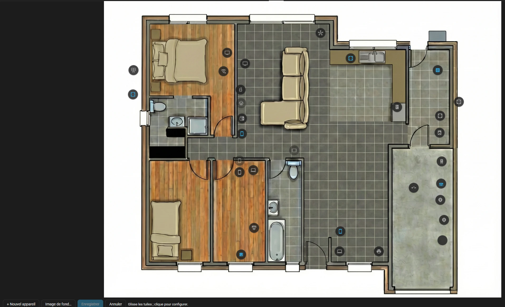

# Tile Placer Card

[](https://github.com/hacs/integration)

[](https://buymeacoffee.com/skytyphoni)

**Français** · [English version](https://github.com/SkyTyphon/tile-placer-card/blob/main/README_eng.md)

[](https://my.home-assistant.io/redirect/hacs_repository/?owner=SkyTyphon&repository=tile-placer-card&category=plugin)

Carte Lovelace (JavaScript natif, un seul fichier, sans build, sans dépendance) qui pose des **bulles** (icône MDI, nom, état d'une entité) sur une **image de fond**, par exemple le plan de ta maison. Les bulles se placent en pourcentage, se déplacent **directement sur la carte** à la souris ou au doigt, et se configurent une par une (nom, icône, entité, taille, couleur, actions au clic, au double clic et à l'appui long) dans un panneau qui s'ouvre sur le plan. Les modifications sont enregistrées dans le dashboard.

Elle s'inspire de l'add-on HA Views, mais elle est livrée sous forme de carte.



*Capture d'écran réelle, en mode édition : des appareils posés sur un plan, avec la barre d'outils en bas (« Nouvel appareil », « Image de fond… », « Enregistrer », « Annuler »).*

> **État :** version `0.x`. Utilisée sur l'instance Home Assistant de l'auteur, dans un navigateur de bureau : déplacement, panneau de sélection, vue plein écran, actions au clic et nouvel appareil fonctionnent. Les écrans tactiles et l'application Companion ne sont **pas testés**. Voir [Limites connues](#limites-connues).

## Sommaire

1. [Installation](#installation)
2. [Démarrage rapide](#démarrage-rapide)
3. [Utiliser la carte au quotidien](#utiliser-la-carte-au-quotidien)
4. [Modifier le plan](#modifier-le-plan)
5. [Configuration YAML](#configuration-yaml)
6. [Actions](#actions)
7. [Conseils](#conseils)
8. [Limites connues](#limites-connues)
9. [Dépannage](#dépannage)
10. [Développement](#développement)

## Installation

### Avec HACS (dépôt personnalisé)

[**Tile Placer Card** dans HACS](https://my.home-assistant.io/redirect/hacs_repository/?owner=SkyTyphon&repository=tile-placer-card&category=plugin) · [Code source sur GitHub](https://github.com/SkyTyphon/tile-placer-card)

**Méthode rapide :** clique sur le bouton, il ouvre ton Home Assistant sur la page du dépôt dans HACS. Valide l'ajout du dépôt, puis clique sur **Télécharger**.

[](https://my.home-assistant.io/redirect/hacs_repository/?owner=SkyTyphon&repository=tile-placer-card&category=plugin)

Le bouton passe par My Home Assistant : à la première utilisation, indique l'adresse de ton instance. HACS doit déjà être installé.

**Méthode manuelle :**

1. Dans HACS, ouvre le menu ⋮ puis **Dépôts personnalisés**.
2. Dépôt : `https://github.com/SkyTyphon/tile-placer-card`, type **Tableau de bord** (Lovelace).
3. Installe **Tile Placer Card**, puis recharge le navigateur avec Ctrl+F5.

HACS déclare la ressource tout seul. Les mises à jour passent aussi par HACS.

### À la main

1. Copie `tile-placer-card.js` dans `/config/www/`.
2. Va dans Paramètres, Tableaux de bord, menu ⋮, **Ressources**, et ajoute `/local/tile-placer-card.js?v=0.9.5` en type **Module JavaScript**.
3. Change la valeur de `?v=` à chaque mise à jour : Home Assistant garde `/local/` en cache très longtemps.

## Démarrage rapide

1. **Ajoute la carte sans écrire de YAML.** Modifie ton dashboard, clique sur **Ajouter une carte**, cherche **Tile Placer Card**. Pour une carte qui occupe tout l'écran, mets-la dans une vue de type **Panneau (1 carte)**.
2. **Ajoute ton image de fond.** Sur une carte sans image, clique sur la carte : un dialogue propose d'**envoyer le plan** (PNG, JPG…) depuis ton ordinateur. L'image est stockée dans Home Assistant, enregistrée dans la carte, et les proportions sont lues sur l'image : rien à calculer. Tu peux aussi indiquer l'adresse d'une image déjà présente, par exemple `/local/plan.png` pour un fichier de `/config/www/`.
3. **Clique sur « Créer la page « Plan » en un clic ».** Ce bouton apparaît sur la carte neuve, pour les administrateurs. Il crée un dashboard **Plan** dans la barre latérale, avec la carte en plein écran, et t'y emmène : l'adresse est `/plan-editable`. Ensuite, un clic sur « Plan » dans la barre latérale suffit.
   (Si tu préfères placer la carte toi-même, enregistre le dashboard et quitte le mode édition de Home Assistant.)
4. **Clique sur le crayon** en haut à droite de la carte, puis sur **+ Nouvel appareil**. Choisis l'entité dans le panneau, glisse la bulle à sa place, clique sur **Enregistrer**. Le bouton **Image de fond…** de la barre d'outils permet de changer l'image à tout moment.

Le crayon n'apparaît que pour un compte administrateur. Le même réglage en YAML :

```yaml
type: custom:tile-placer-card
background: /local/plan.png
fit_screen: true
tiles: []
```

## Utiliser la carte au quotidien

En dehors du mode édition, la carte se comporte comme un tableau de bord normal :

- **Clic** : action au clic. Sans réglage, une bulle liée à une entité ouvre la fenêtre « plus d'infos ».
- **Double clic** : action au double clic, si elle est définie. Dans ce cas, le clic simple est retardé de 250 ms pour distinguer les deux.
- **Appui long** : action à l'appui long (500 ms), si elle est définie.
- **Survol** : le nom de la bulle s'affiche (selon le réglage « Affichage du nom »).
- Une bulle dont l'entité est active (allumée, ouverte, en cours…) prend la couleur d'accent ou la couleur choisie. Une bulle dont l'entité est indisponible ou introuvable est grisée avec un contour en pointillés.

## Modifier le plan

### Entrer en mode édition

Clique sur le **crayon**. Un cadre en pointillés et une grille apparaissent, et une barre d'outils s'affiche sous le plan : **+ Nouvel appareil**, **Image de fond…** (envoyer ou changer l'image), **Enregistrer**, **Annuler** et un message d'état.

### Déplacer une bulle

Glisse la bulle avec la souris ou le doigt. Avec une bulle qui a le focus, les flèches la déplacent de 1 %, et Maj + flèches de 5 %.

### Créer un appareil

Clique sur **+ Nouvel appareil**. Une bulle de 36 px apparaît près du centre, sur un emplacement libre pour ne pas se superposer à une autre, et son panneau s'ouvre. Choisis d'abord l'**appareil** dans le menu déroulant « Appareil » : sa première entité utile est choisie pour toi et son nom est repris. Tu peux ensuite changer l'entité. Sans appareil, choisis directement une entité. L'icône de l'entité est utilisée tant que tu n'en choisis pas une toi-même. Glisse ensuite la bulle à sa place.

### Régler une bulle

Clique sur une bulle (sans la déplacer) pour la sélectionner : un panneau flottant s'ouvre sur le plan et chaque changement se voit **en direct** sur la carte.

| Réglage | Effet |
|---|---|
| Nom | Texte affiché. Sans nom, c'est le nom de l'entité. |
| Icône | Icône MDI. Sans icône, c'est celle de l'entité. |
| Appareil | Menu déroulant des appareils de Home Assistant. Choisit l'entité principale de l'appareil et reprend son nom si la bulle n'en a pas. |
| Entité | Entité liée (état, plus d'infos, bascule…). |
| Affichage du nom | Au survol et à la sélection, toujours, ou jamais. |
| Forme | Rond, carré arrondi, carré ou rectangle. |
| Taille (hauteur) | Taille de la bulle, de 20 à 300 px. |
| Largeur | Pour la forme rectangle seulement, de 20 à 400 px. |
| Couleur de l'icône | Couleur CSS, variable de thème, ou sélecteur de couleur. |
| Afficher l'état sous la bulle | Ajoute l'état de l'entité sous la bulle. |
| Fond transparent | Icône seule, sans disque de fond. |
| Actions | Clic, double clic, appui long (voir [Actions](#actions)). |
| Supprimer la bulle | Retire la bulle après confirmation. |

**Redimensionner à la main :** une bulle sélectionnée affiche une poignée carrée en bas à droite. Glisse-la pour agrandir ou réduire la bulle (pour un rectangle, la largeur et la hauteur suivent séparément). Les curseurs du panneau donnent la même chose, plus précisément.

Un clic sur une zone vide du plan désélectionne la bulle.

### Enregistrer ou annuler

- **Enregistrer** écrit les bulles dans le dashboard puis quitte le mode édition. Le bouton n'est actif que s'il y a des modifications.
- **Annuler** abandonne les modifications non enregistrées, après confirmation.

L'enregistrement relit la configuration du dashboard, retrouve cette carte par comparaison exacte avec la configuration chargée au départ, remplace sa liste `tiles` et enregistre. Si la carte a été modifiée ailleurs entre-temps, ou si le dashboard est en mode YAML, une erreur s'affiche et **rien n'est écrit**. Sauvegarde ton dashboard avant le premier enregistrement.

## Configuration YAML

Les réglages généraux (image, titre, proportions, affichage des noms) se font dans l'éditeur visuel de la carte ou en YAML ; le mode édition sur le plan gère les bulles.

```yaml
type: custom:tile-placer-card
title: Rez-de-chaussée
background: /local/plan.png
aspect_ratio: "1200:896"
fit_screen: true
label_mode: hover
tiles:
  - id: salon
    x_pct: 30
    y_pct: 45
    icon: mdi:ceiling-light
    entity: light.salon
    name: Salon
    size: 40
    color: "#ffa500"
    tap_action:
      action: toggle
    double_tap_action:
      action: more-info
```

D'autres exemples sont dans [`examples/basic.yaml`](examples/basic.yaml).

### Options de la carte

| Option | Description |
|---|---|
| `background` | URL de l'image (ex. `/local/plan.png`). Facultatif. Elle doit être accessible sans en-tête d'autorisation : place-la dans `/config/www/`. |
| `aspect_ratio` | Facultatif. Sans valeur, les proportions sont lues sur l'image de fond. Sinon `16:9`, `4/3`, `1.5` ou `56.25%` ; dans ce cas, utilise le vrai rapport de ton image. Sans image ni valeur : `16:9`. |
| `fit_screen` | `true` : la carte est aussi grande que possible sans dépasser la hauteur de l'écran, proportions conservées. Idéal dans une vue Panneau. |
| `screen_offset` | Hauteur en px retirée de la hauteur d'écran quand `fit_screen` est actif (défaut `150`). |
| `label_mode` | Affichage du nom par défaut : `hover` (défaut), `always`, `never`. |
| `title` | Titre de la carte. Facultatif. |
| `editable` | `false` masque le crayon (défaut `true`). Le mode édition exige de toute façon un compte administrateur. |
| `switch_path` | Adresse d'un autre plan (ex. `/dashboard-maison/0`). Ajoute un bouton en haut à gauche pour y basculer. Facultatif. |
| `switch_label` | Texte du bouton de bascule. Facultatif. |
| `tiles` | Liste des bulles. |

### Options d'une bulle

| Option | Description |
|---|---|
| `id` | Identifiant unique (généré s'il manque). |
| `x_pct`, `y_pct` | Centre de la bulle, de 0 à 100 % de la carte. |
| `icon` | Icône MDI. Vide : icône de l'entité. |
| `entity` | Entité liée. Facultatif. |
| `name` | Nom affiché. Sans nom : nom convivial de l'entité. |
| `shape` | `circle` (défaut), `rounded`, `square` ou `rectangle`. |
| `size` | Taille (hauteur) de la bulle en px (défaut 48, de 20 à 300). |
| `width` | Largeur en px, utilisée seulement avec `shape: rectangle` (défaut : 1,6 fois `size`). |
| `color` | Couleur CSS ou variable, appliquée à l'icône. |
| `label_mode` | `hover`, `always` ou `never` pour cette bulle. |
| `show_state` | `true` affiche l'état de l'entité sous la bulle (défaut `false`). |
| `transparent` | `true` : icône seule, sans fond. |
| `tap_action`, `double_tap_action`, `hold_action` | Voir [Actions](#actions). |

Les coordonnées se calculent ainsi : `x_pct = (x + largeur/2) / largeur_image × 100`, de même pour `y_pct` avec la hauteur.

## Actions

Chaque bulle accepte trois actions : `tap_action`, `double_tap_action` et `hold_action`.

| Action | Rôle | Champs |
|---|---|---|
| `none` | Ne fait rien. | |
| `more-info` | Ouvre la fenêtre « plus d'infos » de l'entité. | `entity` (facultatif, sinon celle de la bulle) |
| `toggle` | Bascule l'entité. | `entity` (facultatif) |
| `call-service` | Appelle un service (`perform_action` accepté comme synonyme de `service`). | `service` (`domaine.service`), `data`, `target` |
| `navigate` | Va vers une page du dashboard. | `navigation_path`, `navigation_replace` |
| `url` | Ouvre une adresse dans un nouvel onglet. | `url_path` (`javascript:`, `data:` et `vbscript:` sont refusés) |

Règles :

- Sans `tap_action`, une bulle liée à une entité ouvre « plus d'infos ». Dans le panneau, ce comportement s'appelle « Par défaut ». Le choix « Aucune » force au contraire l'absence d'action.
- Sans `double_tap_action` ni `hold_action`, ces gestes ne font rien.
- Dans le panneau d'édition, les actions s'appliquent **en direct** dès qu'elles sont complètes. Une action incomplète (service sans `domaine.service`, JSON invalide, chemin ou URL manquant) affiche « Pas encore appliqué » et n'est pas écrite.

Exemple d'appel de service à l'appui long :

```yaml
hold_action:
  action: call-service
  service: light.turn_on
  data:
    entity_id: light.salon
    brightness_pct: 100
```

## Basculer entre un ancien plan et cette carte

Si tu as déjà un plan en `picture-elements` et que tu veux passer de l'un à l'autre, relie-les par un bouton dans chaque sens. Seul le **dernier mot de l'adresse** change selon ton dashboard (`/dashboard-maison/0`, `/energy/plan`…) : prends l'adresse de ta page dans la barre du navigateur.

- **Depuis cette carte vers l'autre plan** : renseigne `switch_path` (champ « Lien vers un autre plan » de l'éditeur visuel) :

  ```yaml
  type: custom:tile-placer-card
  switch_path: /dashboard-maison/0
  switch_label: Ancien plan
  ```

- **Depuis le `picture-elements` vers cette carte** : ajoute cet élément dans la carte `picture-elements`, avec l'adresse de la page de Tile Placer Card :

  ```yaml
  - type: icon
    icon: mdi:pencil-ruler
    title: Plan éditable
    style:
      top: 4%
      left: 3%
    tap_action:
      action: navigate
      navigation_path: /dashboard-maison/plan-editable
  ```

## Conseils

- **Carte en grand.** Mets la carte seule dans une vue de type **Panneau** avec `fit_screen: true`. Ajuste `screen_offset` si la carte dépasse ou laisse trop de marge.
- **Image de fond.** Un fichier dans `/config/www/` est servi sous `/local/`. N'utilise pas `/media/` : ces fichiers demandent une autorisation que la balise image ne fournit pas.
- **Rapport de l'image.** Laisse `aspect_ratio` vide : il est lu sur l'image. Si tu le fixes à la main, divise la largeur par la hauteur du fichier ; une valeur fausse décale toutes les bulles.
- **Nom plutôt qu'état.** Pour une vue dense, laisse `show_state: false` et `label_mode: hover`, puis active l'état seulement sur les capteurs utiles.
- **Plusieurs cartes identiques.** Ajoute un champ distinctif comme `title` pour que l'enregistrement sache laquelle modifier.

## Limites connues

- L'enregistrement fonctionne **uniquement** pour les dashboards en mode stockage (modifiés depuis l'interface), pas pour les dashboards YAML.
- Le dashboard est déduit du premier segment de l'URL (`/lovelace/...` = dashboard par défaut). Une carte affichée ailleurs (aperçu de l'éditeur de carte, fenêtre) peut ne pas pouvoir enregistrer.
- L'enregistrement est refusé si deux cartes du dashboard sont rigoureusement identiques.
- Les actions sont codées dans la carte, sans le `handleAction` natif : pas de `confirmation`, de `haptic` ni de `repeat`.
- L'éditeur visuel couvre les réglages généraux seulement ; les bulles se gèrent sur le plan.
- Si `ha-icon-picker` ou `ha-entity-picker` ne sont pas encore chargés (composants chargés à la demande par Home Assistant), le panneau bascule sur des champs texte.
- En mode édition, les événements souris et tactiles des bulles ne remontent pas aux modules de navigation par balayage comme `hass-swipe-navigation`, sinon un glissement changerait de vue au lieu de déplacer la bulle.
- L'envoi de l'image utilise l'intégration Home Assistant « Image » (active par défaut). Elle est limitée à 10 Mo ; sinon, indique l'adresse d'un fichier de `/config/www/`.
- Écrans tactiles et application Companion : non testés.

## Dépannage

- **« Custom element doesn't exist » ou carte vide.** La ressource n'est pas chargée. Vérifie Paramètres, Tableaux de bord, Ressources, puis fais Ctrl+F5.
- **Les bulles ne sont pas au bon endroit.** `aspect_ratio` ne correspond pas au vrai rapport de l'image.
- **Pas de crayon.** Le compte n'est pas administrateur, ou `editable: false` est réglé.
- **« Écart détecté » à l'enregistrement.** La carte a changé dans le dashboard depuis le chargement de la page. Recharge la page et refais tes modifications.
- **Impossible de glisser une bulle.** Un module de balayage capte peut-être le geste. Vérifie que tu es en mode édition (cadre en pointillés).
- **L'image de fond ne s'affiche pas.** Le fichier n'est pas dans `/config/www/` ou l'adresse est fausse. Teste `/local/plan.png` dans le navigateur.
- **Une action ne répond pas.** Rouvre le panneau de la bulle : un message « Pas encore appliqué » indique le champ à corriger. Pense à enregistrer ensuite.

## Développement

Aucun build. Vérifie la syntaxe avec :

```bash
node --check tile-placer-card.js
```

Pour publier une version : incrémente `TPC_VERSION`, crée une release GitHub contenant `tile-placer-card.js`, puis mets à jour dans HACS.

## Licence

MIT
