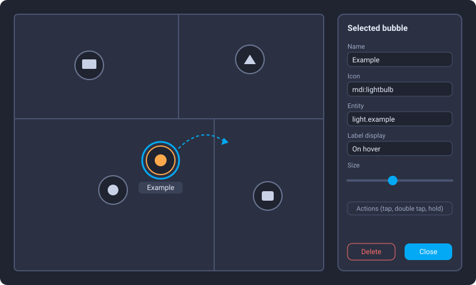

# Tile Placer Card

[](https://github.com/hacs/integration)

A Lovelace card (plain JavaScript, single file, no build, no dependency) that places **tiles** (MDI icon + label +
optional entity state) on a **background image** — a floor plan, for instance. Tiles are positioned in percent,
dragged around **directly on the map**, and configured one by one (icon, entity, name, size, colour, tap / double tap /
hold actions) from a panel that opens on the map. Changes are saved back into the dashboard.

Inspired by the HA Views add-on, but delivered as a card.



*Illustration of the layout (not a screenshot): bubbles on a plan, a selected bubble and its panel.*

> **Status:** `0.x`. Used on the author's own Home Assistant instance (desktop browser): drag and drop, selection
> panel, full-screen panel view. Touch devices and the Companion app are **not tested**. See [Known limitations](#known-limitations).

## Installation

### HACS (custom repository)

1. HACS → ⋮ → **Custom repositories**.
2. Repository: `https://github.com/SkyTyphon/tile-placer-card`, type **Dashboard** (Lovelace).
3. Install **Tile Placer Card**, then reload the browser (Ctrl+F5).

HACS registers the resource automatically.

### Manual

1. Copy `tile-placer-card.js` to `/config/www/`.
2. Settings → Dashboards → ⋮ → **Resources** → add `/local/tile-placer-card.js?v=0.4.0`, type **JavaScript module**.
3. Bump the `?v=` value after each update (Home Assistant caches `/local/` for a long time).

## Configuration

```yaml
type: custom:tile-placer-card
background: /local/plan.png
aspect_ratio: "1200:896"
fit_screen: true
tiles:
  - id: living
    x_pct: 30
    y_pct: 45
    icon: mdi:ceiling-light
    entity: light.living_room
    name: Living room
```

More in [`examples/basic.yaml`](examples/basic.yaml).

### Card options

| Option | Description |
|---|---|
| `background` | Image URL (e.g. `/local/plan.png`). Optional. Must be reachable without an authorization header, so put it in `/config/www/`. |
| `aspect_ratio` | `16:9`, `4/3`, `1.5` or `56.25%` (default `16:9`). **Use the real ratio of your image**, otherwise tile positions will not match the picture. |
| `fit_screen` | `true`: the card is as large as possible without exceeding the screen height (aspect ratio kept). Best in a `panel` view. |
| `screen_offset` | Height in px removed from the screen height when `fit_screen` is on (default `150`). |
| `label_mode` | Default label display: `hover` (default), `always`, `never`. |
| `title` | Optional card title. |
| `editable` | `false` hides the pencil (default `true`). Editing also requires an administrator account. |
| `tiles` | List of tiles. |

### Tile options

| Option | Description |
|---|---|
| `id` | Unique id (generated when missing). |
| `x_pct`, `y_pct` | Centre of the tile, 0–100 % of the card. |
| `icon` | MDI icon. When empty, the entity icon is used. |
| `entity` | Optional entity (state, `more-info`, toggle…). |
| `name` | Label. Falls back to the entity friendly name. |
| `size` | Bubble diameter in px (default 48). |
| `color` | Any CSS colour or variable, applied to the icon. |
| `label_mode` | `hover`, `always` or `never` for this tile. |
| `show_state` | `true` shows the entity state under the bubble (default `false`). |
| `transparent` | `true`: icon only, no bubble background. |
| `tap_action`, `double_tap_action`, `hold_action` | See below. |

Actions: `none`, `more-info`, `toggle`, `call-service` (`service` or `perform_action`, `data`, `target`), `navigate`
(`navigation_path`), `url` (`url_path`; `javascript:`, `data:` and `vbscript:` are refused).
Default tap action: `more-info` when an entity is set. With a double tap action, the single tap is delayed by 250 ms.
Hold = 500 ms.

## Editing

1. Click the **pencil** (top right of the card, administrators only). A dashed frame and a grid appear.
2. **Drag** a tile, with mouse or finger. Arrow keys move the selected tile by 1 %, Shift + arrows by 5 %.
3. **Click** a tile to select it: a panel opens over the map with live preview — name, icon, entity, label display,
   size, colour, state, transparent background, delete. Actions apply live as soon as they are valid; "Default" on tap keeps the more-info behaviour.
4. Click on empty space to deselect. **+ New device** creates a bubble near the centre and selects it (pick its entity and icon in the panel).
5. **Save** writes the tiles into the dashboard; **Cancel** discards the changes.

Saving re-reads the dashboard configuration, finds this card by exact comparison with the configuration it was loaded
with, replaces its `tiles` and saves. If the card changed elsewhere in the meantime, or if the dashboard is in YAML
mode, an error is shown and **nothing is written**. Back up your dashboard before the first save.

## Known limitations

- Saving works **only** for dashboards in storage mode (edited from the UI), not YAML dashboards.
- The dashboard is deduced from the first URL segment (`/lovelace/...` = default dashboard). A card shown in another
  context (card editor preview, dialog) may not be able to save.
- Saving is refused when two cards of the dashboard are exactly identical; add a distinguishing field such as `title`.
- Actions are implemented inside the card (no native `handleAction`): no `confirmation`, `haptic` or `repeat`.
- No visual card editor: configure in YAML, then use the on-map editing mode.
- If `ha-icon-picker` / `ha-entity-picker` are not loaded yet (lazy Home Assistant components), the panel falls back
  to text fields.
- In edit mode, mouse and touch events from tiles are stopped from reaching swipe-navigation modules such as
  `hass-swipe-navigation`, otherwise a drag may change the view instead of moving the tile.

## Development

No build step. Check the syntax with `node --check tile-placer-card.js`.

---

# Français

Carte Lovelace (JavaScript natif, un seul fichier, sans build) qui pose des **bulles** (icône MDI + nom + état d'une
entité) sur une **image de fond**, par exemple un plan de maison. Les bulles se déplacent **directement sur la carte**
et se configurent une par une (icône, entité, nom, taille, couleur, actions clic / double clic / appui long) dans un
panneau qui s'ouvre sur le plan. Les modifications sont enregistrées dans le dashboard.

## Installation (HACS)

1. HACS → ⋮ → **Dépôts personnalisés**.
2. Dépôt : `https://github.com/SkyTyphon/tile-placer-card`, type **Tableau de bord**.
3. Installer **Tile Placer Card**, puis rechargement forcé du navigateur (Ctrl+F5).

## Utilisation rapide

1. Mets l'image du plan dans `/config/www/` et indique-la dans `background`. Renseigne le **vrai ratio** de l'image dans
   `aspect_ratio` (ex. `1200:896`).
2. Pour une carte en grand, mets la carte seule dans une vue de type `panel` avec `fit_screen: true`.
3. Clique sur le **crayon**, glisse les bulles, clique sur une bulle pour régler son nom, son icône, sa taille…
4. **Enregistrer**. Sauvegarde le dashboard avant le premier enregistrement.

## Licence

MIT
